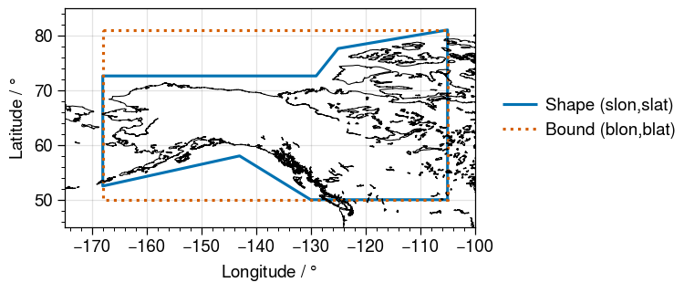

# A Basic Primer to `GeoRegion`s

In essence, a `GeoRegion` is:
* a geographical region that can be either rectilinear region (`RectRegion`), or a polygonal shape within a specified rectilinear bound (`PolyRegion`).
* identified by a `regID`
* itself a subregion of a **parent** `GeoRegion` (identified by `parID`, which must itself be a valid `ID`)

!!! tip "Default GeoRegions"
    When using `GeoRegions.jl`, the default `GeoRegion` should generally be the global domain, specified by `GLB` and given by the `[N,S,E,W]` coordinates `[90,-90,360,0]`.  The Global GeoRegion `GLB` is considered to be a subset of itself.

See the [documentation for GeoRegions.jl](https://juliaclimate.github.io/GeoRegions.jl/dev/index.html) for more details on what `GeoRegion`s are, and the GeoRegions.jl package.

## An Example of a `GeoRegion`

In GeoRegions.jl, there are three sets of predefined `GeoRegion`s:
1. Adapted from Giorgi & Francisco [2000], with a `regID` created by adding the `GF_` prefix to the IDs in the paper
2. Adapted from Seneviratne et al. [2012], with a `regID` created by adding the `SRX_` prefix to the IDs in the paper
3. Adapted from Iturbide et al., [2020], with a `regID` created by adding the `AR6_` prefix to the IDs in the paper

!!! compat "Defined only in GeoRegions.jl ≥ v1.1"
    All `GF_*` domains are defined only in versions ≥1.1, while `SRX_*`and `AR6_*` domains are defined only in versions ≥2.  This should not be a problem, because NASAPrecipitation.jl requires GeoRegions v2.1 and above.

Now, let us plot an example `GeoRegion`

```@repl
using NASAPrecipitation
blon,blat,slon,slat = coordGeoRegion(GeoRegion("AR6_NWN"))
```

Here, `blon` and `blat` denote the longitude and latitude coordinates of the rectangular domain that bounds the `GeoRegion`, while `slon` and `slat` define the actual `GeoRegion` itself.



## NASAPrecipitation.jl reexports GeoRegion.jl

For ease of use, NASAPrecipitation.jl reexports all the functionality of GeoRegions.jl.

By default, NASAPrecipitation.jl will download all available data.  This means
* For `IMERGDataset`s, the data spans 89.95ºS to 89.95ºN
* For `TRMMDataset`s, the data spans 49.875ºS to 49.875ºN
* For the TRMM Land-Sea Mask, the data spans 89.875ºS to 89.875ºN

In NASAPrecipitation.jl, we therefore define the `GeoRegion`s `GPM`, `TRMM` and `TRMMLSM` in order to ensure that bounds of the GeoRegion we request do not go out of bounds of what is available.  Upon loading NASAPrecipitation.jl for the first time during any Julia session, NASAPrecipitation.jl will check if these three `GeoRegion`s exist.  However, one can check if they exist at any point (and recreate them if they don't) using the function `addNPDGeoRegions()`

```@repl
using NASAPrecipitation
GeoRegion("IMERG")
GeoRegion("TRMM")
GeoRegion("TRMMLSM")
resetGeoRegions()  # Clear custom GeoRegions
GeoRegion("IMERG")
addNPDGeoRegions() # Adding NASAPrecipitation.jl GeoRegions
GeoRegion("IMERG")
addNPDGeoRegions() # Checking to see if NASAPrecipitation.jl GeoRegions exists
```

```@docs
NASAPrecipitation.addNPDGeoRegions()
```

## How `GeoRegion`s are used in NASAPrecipitation.jl

Test
