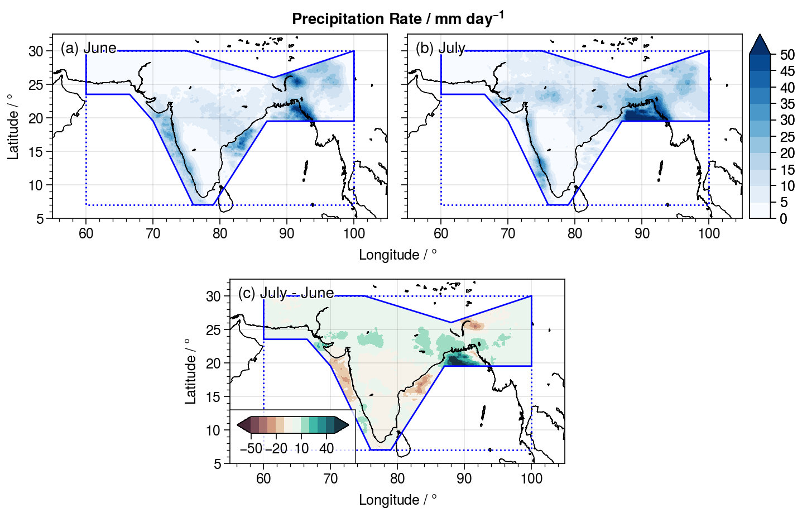

# Downloading and Visualizing IMERG Data

In this example, we download IMERG monthly data in 2015 over the `AR6_SAS` `GeoRegion`, which encompasses the Indian Subcontinent, and do a data vizualization that shows the difference in precipitation over the area between the months of June and July.

## 1. Define the problem:
We do this by specifying the `NASAPrecipitationDataset` and the `GeoRegion`:

```@repl
using NASAPrecipitation
npd = IMERGMonthly(dtbeg=Date(2015,1,1),dtend=Date(2015,1,1),sroot=joinpath(pwd(),"..","..","data")) # NASAPrecipitation.jl downloads monthly data year-by-year
geo = GeoRegion("AR6_SAS") # AR6 regions are automatically defined in GeoRegions.jl v2 and above
download(npd,geo) # will fail because .netrc and .dodsrc are not provided
```

## 2. Read the Data using NCDatasets
We use NCDatasets to read the data
```@repl
using NCDatasets
ds  = NCDataset(joinpath(pwd(),"..","..","data","imergmonthly","AR6_SAS","raw","imergmonthly-AR6_SAS-2015.nc"))
lon = ds["longitude"][:];
lat = ds["latitude"][:];
prc = ds["prcp_rate"][:];
close(ds)
```

## 3. Plotting the data using ProPlot
We then proceed to plot the data for July and January, and the difference between the two.  I use the Python package ProPlot in my example, which can be called in Julia using PyCall, but this can be replicated.

First, I load the coastlines for me the plot (you need your own coastline file)
```julia
coord = readdlm("coastline.txt",comments=true,comment_char='#')
x = coord[:,1]
y = coord[:,2]
```

Next, I load the bounds and the shape of the `AR6_SAS` `GeoRegion`
```julia
blon,blat,slon,slat = coordGeoRegion(geo)
```

Finally, I do the plotting as below:
```julia
using PyCall, LaTeXStrings
pplt = pyimport("proplot")

pplt.close(); f,a = pplt.subplots([[1,1,2,2],[0,3,3,0]],aspect=20/11,axwidth=3)

a[1].contourf(lon,lat,prc[:,:,6]'*86400,cmap="Blues",levels=(0:10)*5,extend="max")
a[1].plot(x,y,c="k",lw=0.5)
a[1].plot(blon,blat,c="b",lw=1,linestyle=":")
a[1].plot(slon,slat,c="b",lw=1)
a[1].format(ultitle="(a) June")

c = a[2].contourf(lon,lat,prc[:,:,7]'*86400,cmap="Blues",levels=(0:10)*5,extend="max")
a[2].plot(x,y,c="k",lw=0.5)
a[2].plot(blon,blat,c="b",lw=1,linestyle=":")
a[2].plot(slon,slat,c="b",lw=1)
a[2].colorbar(c,loc="r")
a[2].format(ultitle="(b) July")

c = a[3].contourf(lon,lat,(prc[:,:,7].-prc[:,:,6])'*86400,cmap="drywet",levels=vcat(-5:5)*10,extend="both")
a[3].plot(x,y,c="k",lw=0.5)
a[3].plot(blon,blat,c="b",lw=1,linestyle=":")
a[3].plot(slon,slat,c="b",lw=1)
a[3].colorbar(c,loc="ll")
a[3].format(ultitle="(c) July - June")

for ax in a
    ax.format(xlim=(55,105),ylim=(5,32.5),suptitle=L"Precipitation Rate / mm day$^{-1}$")
end
```


As we can see, the data downloaded is a grid spanning the bounds (blue dotted line), but only within the actual shape of the `GeoRegion` (blue solid line) is there actual valid data.
