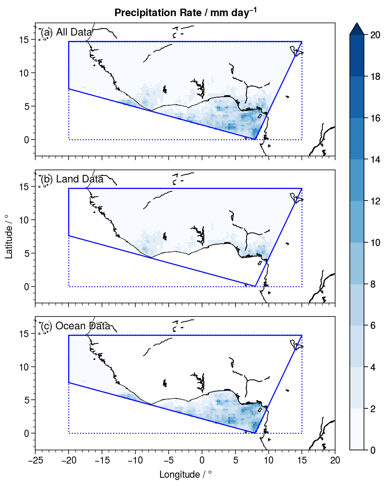

# Filtering TRMM Data using the Land-Sea Masks

In this example, we download near real-time TRMM daily data for the month of February 2012 in the West African (`WAF`) `GeoRegion`, and use the TRMM Land-Sea Mask to differentiate between land and sea regions.

## 1. Loading TRMM Daily Data

We start first by loading the TRMM daily data

```@repl
using NASAPrecipitation
npd = TRMMDaily(dtbeg=Date(2012,2,1),dtend=Date(2012,2,1)) # NASAPrecipitation.jl downloads daily data month-by-month
geo = GeoRegion("AR6_WAF") # AR6 regions are automatically defined in GeoRegions.jl v2 and above
download(npd,geo)
```

## 2. Loading Land-Sea Mask

Next, we download the TRMM daily data

```@repl
using NASAPrecipitation
geo = GeoRegion("AR6_WAF") # AR6 regions are automatically defined in GeoRegions.jl v2 and above
getTRMMlsm(geo)
```

## 3. Read the Data using NCDatasets

We use NCDatasets to read the data

```@repl
using NCDatasets
using Statistics

ds1 = NCDataset(joinpath(homedir(),"trmmdaily","AR6_WAF","raw","2012","trmmdaily-AR6_WAF-201202.nc"));
ln1 = ds1["longitude"][:];
lt1 = ds1["latitude"][:];
prc = dropdims(mean(ds1["prcp_rate"][:],dims=3),dims=3)
close(ds1)

ds2 = NCDataset(joinpath(homedir(),"trmmlsm-AR6_WAF.nc"))
ln2 = ds2["longitude"][:];
lt2 = ds2["latitude"][:];
lsm = ds2["lsm"][:];
close(ds2)

sum(ln1 .!== ln2) # Check to see if longitude coordinates are the same
sum(lt1 .!== lt2) # Check to see if latitude  coordinates are the same
```

## 4. Extract data over land and over the ocea

Using the `lsm` variable, we are able to separate out the data points over land and over ocean, assuming that values >0.5 are for land, and values <0.5 are over the ocean.

```julia
plnd = deepcopy(prc); plnd[lsm.<0.5] .= NaN
pocn = deepcopy(prc); pocn[lsm.>0.5] .= NaN
```

## 5. Plotting the data using ProPlot
We then proceed to plot the data for July and January, and the difference between the two.  I use the Python package ProPlot in my example, which can be called in Julia using PyCall, but this can be replicated.

First, I load the coastlines for me the plot (you need your own coastline file)

```julia
coord = readdlm("coastline.txt",comments=true,comment_char='#')
x = coord[:,1]
y = coord[:,2]
```

Next, I load the bounds and the shape of the `AR6_WAF` `GeoRegion`

```julia
blon,blat,slon,slat = coordGeoRegion(geo)
```

Finally, I do the plotting as below:

```julia
using PyCall, LaTeXStrings
pplt = pyimport("proplot")

pplt.close(); f,a = pplt.subplots(nrows=3,aspect=9/4,axwidth=4)

a[1].contourf(lon,lat,prc'*86400,cmap="Blues",levels=(0:10)*2,extend="max")
a[1].plot(x,y,c="k",lw=0.5)
a[1].plot(blon,blat,c="b",lw=1,linestyle=":")
a[1].plot(slon,slat,c="b",lw=1)
a[1].format(ultitle="(a) All Data")

a[2].contourf(lon,lat,plnd'*86400,cmap="Blues",levels=(0:10)*2,extend="max")
a[2].plot(x,y,c="k",lw=0.5)
a[2].plot(blon,blat,c="b",lw=1,linestyle=":")
a[2].plot(slon,slat,c="b",lw=1)
a[2].format(ultitle="(b) Land Data")

c = a[3].contourf(lon,lat,pocn'*86400,cmap="Blues",levels=(0:10)*2,extend="max")
a[3].plot(x,y,c="k",lw=0.5)
a[3].plot(blon,blat,c="b",lw=1,linestyle=":")
a[3].plot(slon,slat,c="b",lw=1)
f.colorbar(c,loc="r")
a[3].format(ultitle="(c) Ocean Data")

for ax in a
    ax.format(
        xlim=(-25,20),xlabel=L"Longitude / $\degree$",
        ylim=(-2.5,17.5),ylabel=L"Latitude / $\degree$",
        suptitle=L"Precipitation Rate / mm day$^{-1}$"
    )
end
```



As we can see, we can use the land-sea mask to separate out points over land and over sea within the `GeoRegion`
