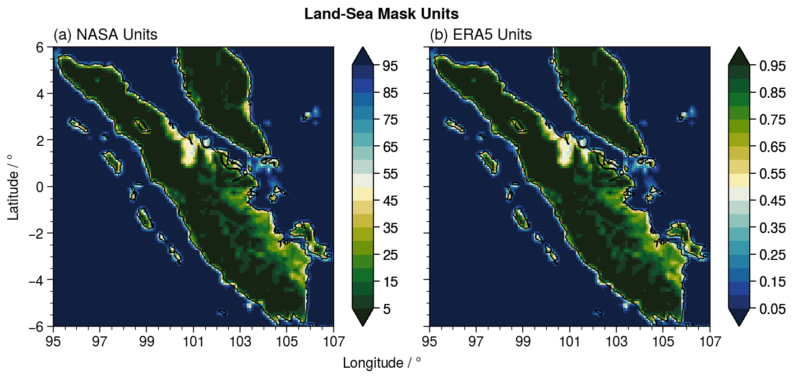

# Land-Sea Mask Datasets

Similar to [GeoRegions.jl](https://github.com/JuliaClimate/GeoRegions.jl), NASA also provides global land-sea masks at the same resolution as the IMERG and TRMM datasets.  NASAPrecipitation.jl is able to retrieve these land-sea masks that allows for us to easily distinguish between precipitation data points over land and over the ocean.

This land-sea mask is then saved into a `LandSea` data type, which is defined to be a subType of the `LandSeaFlat` `abstract type` in [GeoRegions.jl](https://juliaclimate.github.io/GeoRegions.jl/stable/landsea/intro.html).

!!! info "Units for the Land-Sea Mask"
    For standardization purposes, NASAPrecipitation.jl converts the land-sea mask provided by NASA to the same units as the `LandSea` Dataset provided by GeoRegions.jl
    
    0 represents fully ocean, while 1 represents fully land.

    See the figure below:

    

```@docs
NASAPrecipitation.LandSea
```